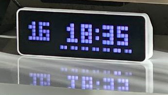

## Introduction

[**EspHoMaTriXv2**](https://github.com/lubeda/EspHoMaTriXv2) is a flexible, highly customizable DIY LED Matrix display, built with a 8×32 RGB LED panel and implemented with [esphome.io](https://esphome.io)

!!! info "EspHoMaTriXv2 Documentation"
    Full documentation with all the nuances is available in the [**EspHoMaTriXv2**](https://github.com/lubeda/EspHoMaTriXv2) component repository.
