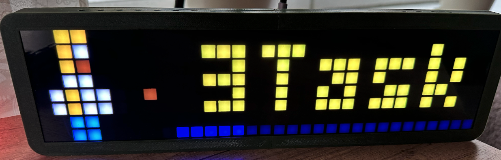
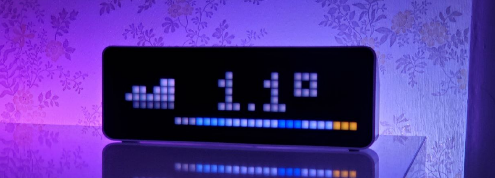
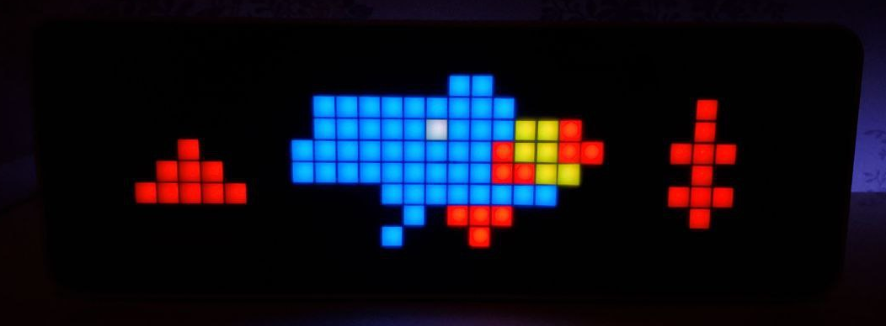

## MODE_ICON_PROGRESS



!!! example annotate "Icon screen progress"

    ``` { .yaml .copy .annotate }
    alias: Pixel Clock - Power
    trigger:
      - platform: state
        entity_id: sensor.home_power
        id: over
      - platform: numeric_state
        entity_id: sensor.home_power
        below: 5000
        id: normal
    condition:
      - condition: template
        value_template: >
          {{ trigger.id == 'normal' or (trigger.id == 'over' and states('sensor.home_power') | int(0) > 5000) }}
    action:
      - action: esphome.pixel_clock_icon_screen_progress
        data:
          icon_name: power
          text: "{{ (states('sensor.home_power') | int(0) / 1000) | round(1) }}kW"
          progress: "{{ -1 * (states('sensor.home_power') | int(0) / 100) | round(0) }}"
          lifetime: "{{ 5 if states('sensor.home_power') | int(0) > 1000 else 3 }}"
          screen_time: 5
          default_font: true
          r: >-
            {{
              240 if states('sensor.home_power') | int(0) > 5000 else
              240 if states('sensor.home_power') | int(0) > 1000 else
              0
            }}
          g: >-
            {{
              0 if states('sensor.home_power') | int(0) > 5000 else
              240 if states('sensor.home_power') | int(0) > 1000 else
              240
            }}
          b: 0
    mode: restart
    ```
## MODE_PROGNOSIS_SCREEN



!!! tip Home Assistant
    Additional examples and screenshots are available at the [link](https://github.com/lubeda/EspHoMaTriXv2/issues/149)

## MODE_BITMAP_SCREEN



!!! warning
    This feature is only available on ESP32 platform !!!

For **8x32** images as text. You can generate these images with, e.g., [Bitmap Editor](bitmap-editor.md) or just open the [Bitmap Converter](converter.md) and select the images you want. This tool will automatically scale and convert your images into the correct **RGB565** format for the `bitmap_screen` service.

!!! example annotate "Service via API"

    ``` { .yaml .copy .annotate }
    bitmap_screen => {"[0,4523,0,2342,0,..... (256 values 16bit values rgb565)]", "lifetime", "screen_time"}
    ```

!!! example annotate "Lambda"

    ``` { .c .copy .annotate }
    void bitmap_screen(string text, int =D_LIFETIME, int screen_time=D_SCREEN_TIME);
    ```
